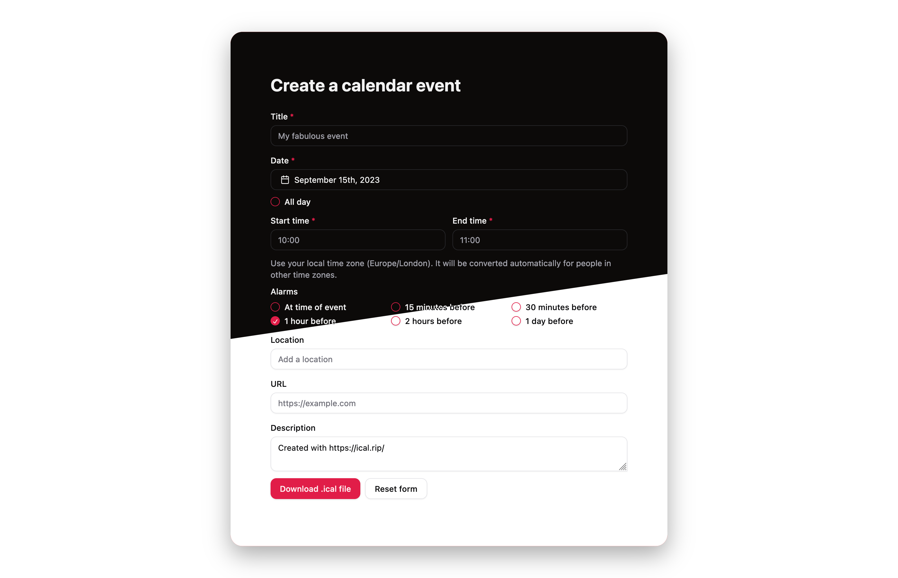

<h1 align="center"><a href="https://ical.rip/">ical.rip</a></h1>

Generate an iCal file online

<a href="https://www.sqaico.com/joeanderson/building-an-online-ical-file-generator-using-shadcn-ui">Read the blog post</a>

